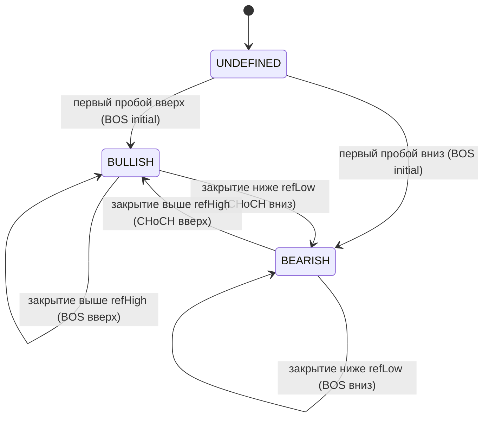
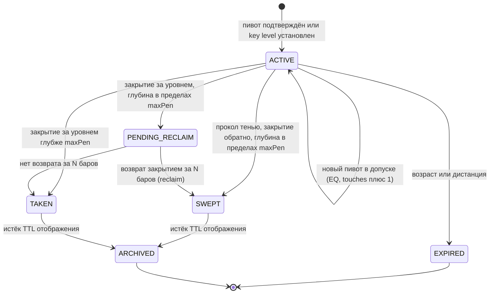
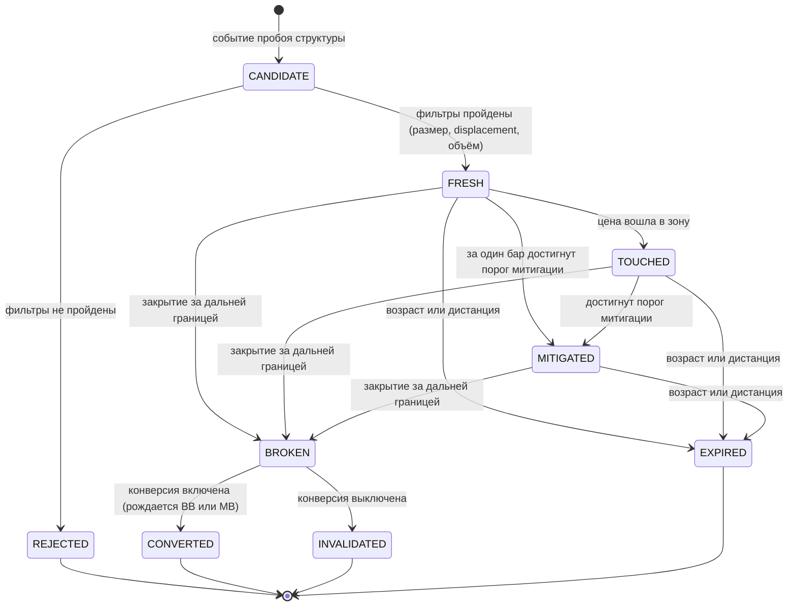
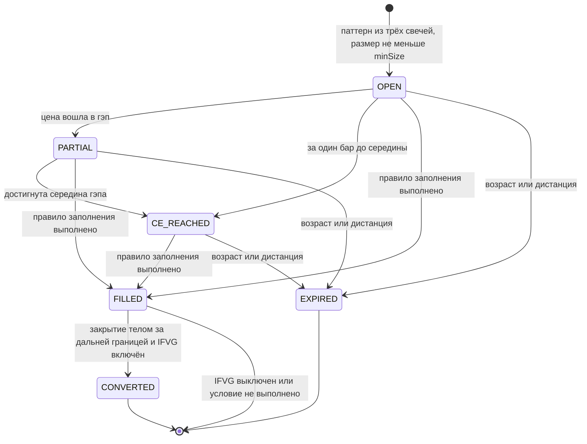
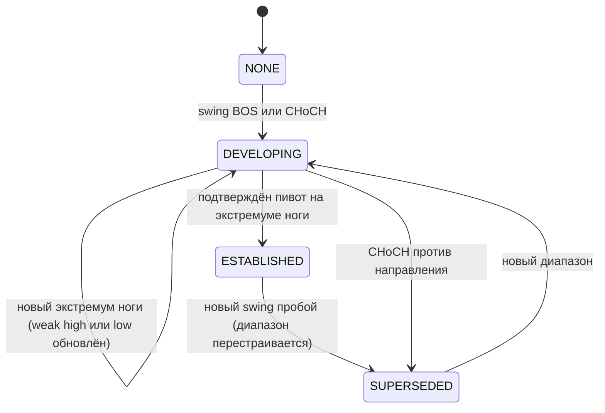
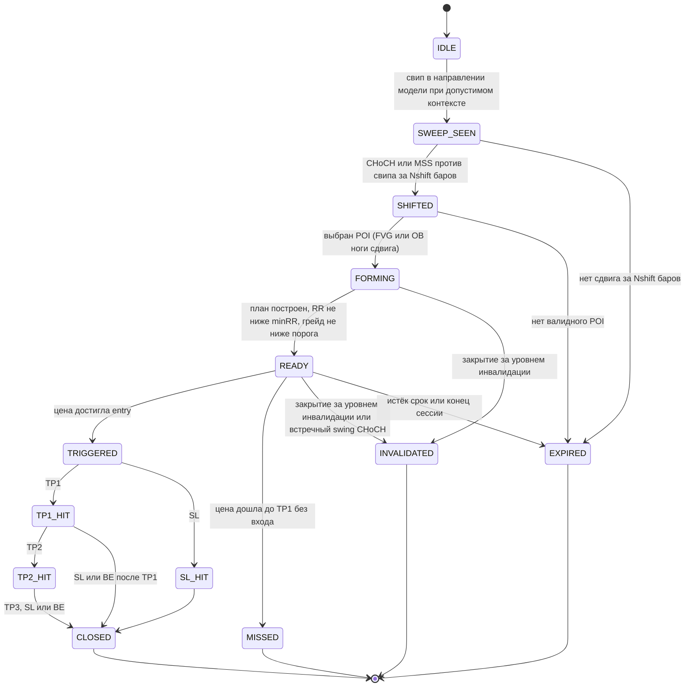
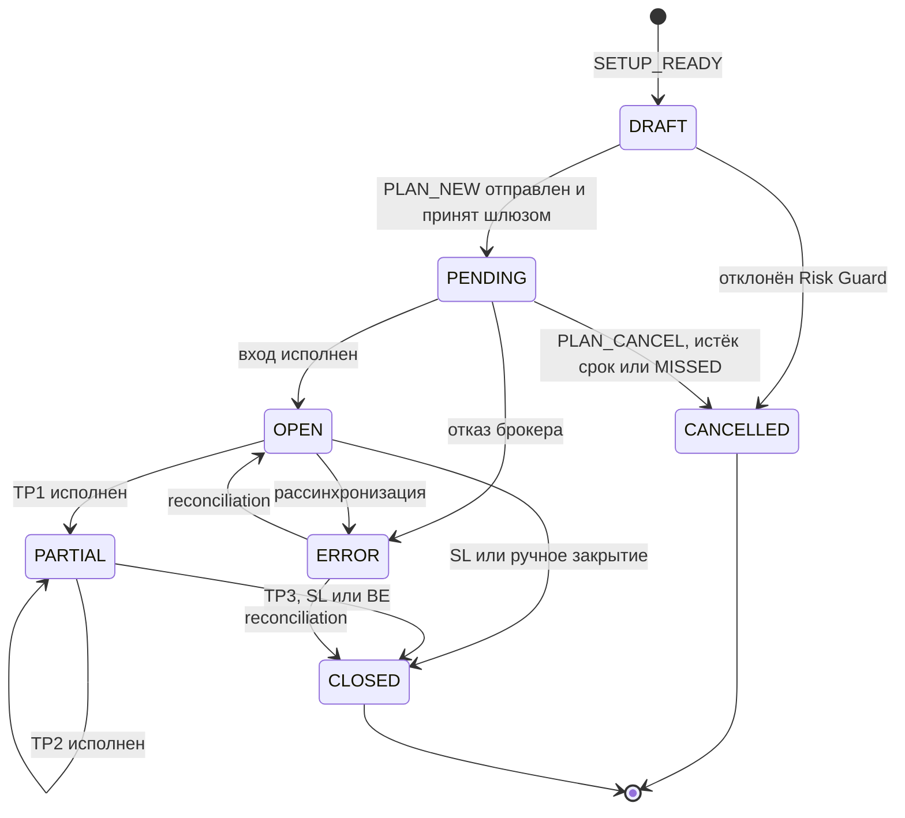

# 03 · Модели предметной области

> Покрывает результаты анализа **№6–12**: Event Model, State Machines, Object Model, Setup Model, TradePlan Model, Risk Model, Webhook Model.
> Модели описаны таблицами и схемами, без кода. Типы указаны в терминах Pine v6 (`int`, `float`, `bool`, `string`, `enum`, UDT, `array<>`, `map<>`).
> Числовые пороги и формулы детекторов — в [`appendix-a-detection-spec.md`](appendix-a-detection-spec.md).

---

## 6. Event Model

### 6.1 Назначение

Событие — **неизменяемый факт** о переходе состояния, зафиксированный на закрытии бара. Событиями пользуются все потребители: Visual Engine (метки, Setup Path), Alert Engine, Dashboard/Ribbon, Analytics. Потребители **не вычисляют** условия заново.

### 6.2 Структура события (`Event`)

| Поле | Тип | Описание |
|---|---|---|
| `id` | int | Монотонный внутренний ID (в пределах расчёта) |
| `key` | string | Внешний детерминированный ключ: `<tickerid>\|<tf>\|<barTime>\|<type>\|<ordinal>` (ADR-12) |
| `type` | enum `EventType` | Тип события (каталог §6.4) |
| `dir` | int | +1 / −1 / 0. Семантика задана для каждого типа в §6.4 |
| `tfSlot` | enum `TfSlot` | `CHART`, `HTF1`, `HTF2` |
| `barTime` | int | Время открытия бара события, мс |
| `barIndex` | int | Индекс бара. Только для внутренних нужд, наружу не отдаётся |
| `price` | float | Опорная цена события |
| `refId` | int | ID объекта-субъекта (Swing, Level, Zone, Setup, Plan) |
| `causeId` | int | ID события-причины (`na`, если нет). Основа причинно-следственной цепочки |
| `setupId` | int | ID сетапа, в который событие вошло (`na`, если не входит) |
| `tier` | int | 1–4, визуальная и алертная значимость по умолчанию |
| `v1`, `v2`, `v3` | float | Типоспецифичный payload (§6.4) |
| `s1` | string | Типоспецифичная строка (метка, причина, сессия) |

> Payload хранится в общих слотах `v1…v3/s1`, а не в отдельных UDT на каждый тип. Так один тип очереди и истории покрывает весь каталог, а сериализация в JSON идёт через таблицу соответствия.

### 6.3 Механика шины

| Элемент | Описание |
|---|---|
| `barEvents` | `array<Event>`: очищается в начале логического шага бара, заполняется движками по порядку §4.5 |
| `history` | Кольцевой буфер (по умолчанию 300 событий; Analysis/Debug — до 1000) |
| `lastByType` | `map<int, Event>`: последнее событие каждого типа (для Ribbon/Dashboard: «SSL SWEPT · 3 bars») |
| `ordinal` | Порядковый номер события внутри бара. Входит в `key` |
| Эмиссия | Только из L1–L4 и только при `barstate.isconfirmed` |
| Подписчики | Читают `barEvents` после шага 9 (§4.5). В шину ничего не пишут |
| Preview | Не является событием: формируется Visual Engine из состояния и в шину не попадает |

### 6.4 Каталог событий

**Семантика `dir`:** для структурных событий и зон — направление объекта. Для свипов — **ожидаемое направление реакции** (SSL swept → +1). Для TAKEN — направление пробоя.

| Тип | Источник | `dir` | `price` | `v1 / v2 / v3 / s1` | Tier | alertcondition | Webhook (по умолч.) |
|---|---|---|---|---|:---:|:---:|:---:|
| `SWING` | Structure | +1 high / −1 low | цена пивота | level (0 int / 1 swing) / — / — / HH·HL·LH·LL·EQH·EQL | 3 | — | — |
| `BOS` | Structure | направление | пробитый уровень | level / displacement (ATR) / — / — | 1 (swing), 3 (int) | ✅ | ✅ |
| `CHOCH` | Structure | направление | пробитый уровень | level / displacement / isMSS (0/1) / — | 1 (swing), 3 (int) | ✅ | ✅ |
| `DISPLACEMENT` | Data | направление | close бара | сила (ATR) / баров в ноге / FVG в ноге (0/1) / — | 3 | — | — |
| `LIQ_NEW` | Liquidity | +1 BSL / −1 SSL | уровень | kind / importance / — / тег (PDH, AH, EQH…) | 3 | — | — |
| `LIQ_EQ` | Liquidity | +1 / −1 | уровень кластера | touches / importance / — / EQH·EQL | 2 | — | ✅ |
| `LIQ_SWEPT` | Liquidity | реакция | уровень | penetration (ATR) / sweepType (1 wick, 2 reclaim, 3 turtle soup) / importance / BSL·SSL + тег | 1 (major), 2 (minor) | ✅ | ✅ |
| `LIQ_TAKEN` | Liquidity | направление пробоя | уровень | penetration / — / importance / BSL·SSL + тег | 2 | — | ✅ |
| `LIQ_EXPIRED` | Liquidity | — | уровень | — | 4 | — | — |
| `KEYLEVEL_SET` | Liquidity | +1 / −1 | уровень | — / — / — / PDH·PDL·PWH·PWL·AH·AL·LOH·LOL·MOP | 3 | — | — |
| `ZONE_NEW` | Zone | направление | mid (CE) | kind / top / bottom / — | 2 | — | опц. |
| `ZONE_TOUCHED` | Zone | направление зоны | цена касания | kind / penetration % / touches / — | 2 | ✅ (OB touch) | ✅ |
| `ZONE_MITIGATED` | Zone | направление | цена | kind / penetration % / — / — | 3 | — | опц. |
| `ZONE_CE` | Zone | направление | CE | kind / — / — / — | 3 | — | — |
| `ZONE_FILLED` | Zone | направление | цена | kind / fill % / — / — | 3 | ✅ (FVG fill) | опц. |
| `ZONE_BROKEN` | Zone | направление зоны | цена закрытия | kind / — / — / — | 2 | — | опц. |
| `ZONE_CONVERTED` | Zone | **новое** направление | mid | новый kind (BB/MB/IFVG) / parentId / — / — | 2 | — | ✅ |
| `ZONE_EXPIRED` | Zone | — | — | kind | 4 | — | — |
| `RANGE_NEW` | Context | направление ноги | EQ | high / low / developing (0/1) / — | 3 | — | — |
| `PD_ENTER` | Context | — | цена | pd % / — / — / PREMIUM·DISCOUNT·EQ | 3 | ✅ | опц. |
| `OTE_ENTER` | Context | направление диапазона | цена | pd % / — / — / — | 2 | ✅ | опц. |
| `SESSION_START` | Context | — | open | — / — / — / ASIA·LONDON·NY_AM·LC·NY_PM·SB1·SB2·SB3 | 3 | ✅ (killzone) | опц. |
| `SESSION_END` | Context | — | close | session high / session low / — / имя | 3 | — | — |
| `HTF_BIAS` | Context | новый bias | close | — / — / — / TF | 1 | — | ✅ |
| `REGIME` | Context | — | — | — / — / — / TRENDING·RANGING | 3 | — | — |
| `SETUP_FORMING` | Setup | направление | — | model / stage / score / — | 1 | — | ✅ |
| `SETUP_READY` | Setup | направление | entry | score / RR / grade-код / chain-строка | 1 | ✅ | ✅ |
| `SETUP_TRIGGERED` | Setup | направление | цена входа | score / RR / — / — | 1 | ✅ | ✅ |
| `SETUP_TP` | Setup | направление | цена TP | n (1–3) / R / — / — | 1 | — | ✅ |
| `SETUP_SL` | Setup | направление | цена SL | R (−1 или BE) / — / — / — | 1 | — | ✅ |
| `SETUP_INVALID` | Setup | направление | цена | — / — / — / причина | 1 | ✅ | ✅ |
| `SETUP_EXPIRED` | Setup | направление | — | — / — / — / причина | 2 | — | ✅ |
| `SETUP_MISSED` | Setup | направление | — | — / — / — / — | 2 | — | ✅ |
| `SIGNAL` | Signal | направление | entry | score / grade / planId / — | 1 | (через SETUP_READY) | ✅ |
| `PLAN_NEW` / `PLAN_AMEND` / `PLAN_CANCEL` | TradePlan | направление | entry | — / — / — / причина | 1 | — | ✅ (v2) |
| `SYS_WARM` | System | — | — | — / — / — / — | 4 | — | — |
| `SYS_WARN` | System | — | — | — / — / — / код (HTF_LOW, NO_VOLUME, NONSTD_CHART…) | 4 | — | ✅ |

### 6.5 Причинность (causeId)

```
LIQ_SWEPT(#101) ──cause──► DISPLACEMENT(#104) ──cause──► CHOCH(#105, MSS)
        │                                                     │
        │                                     ┌───cause───────┤
        ▼                                     ▼               ▼
  SETUP_FORMING(#106)                    ZONE_NEW(#105a,FVG)  ZONE_NEW(#105b,OB)
        │                                     │
        ▼                                     ▼
  SETUP_READY(#120) ◄────── OTE_ENTER(#119) + ZONE_TOUCHED(#119a)
        ▼
  SETUP_TRIGGERED(#121) ──► SETUP_TP(#130, n=1) ──► SETUP_TP(#141, n=2)
```

Правила:
- `CHOCH/BOS.causeId` = последний `DISPLACEMENT` ноги пробоя (если был).
- `ZONE_NEW.causeId` = событие пробоя, породившее зону (для OB) или `DISPLACEMENT` (для FVG в ноге).
- `SETUP_*.causeId` = событие, продвинувшее стадию. Полная цепочка хранится в `Setup.chain` (массив ID событий).
- Analysis Mode строит Setup Path **только** по этим связям, без эвристик.

### 6.6 Идемпотентность и стабильность

- Внутренние `id` могут отличаться между пересчётами (зависят от начала истории). Внешние `key` — нет: они строятся от времени бара.
- Одно и то же событие на одном баре не эмитится дважды (проверка `type + refId` в `barEvents`).
- Ключи объектов (`Zone.key`, `Setup.key`) — от времени бара рождения + kind + dir (§8.2).

---

## 7. State Machines

> Все переходы выполняются **только на подтверждённом баре**. Каждый переход эмитит событие из §6.4.

### 7.1 Структура рынка (на каждый уровень internal/swing и каждый TF slot)



| Элемент | Правило |
|---|---|
| `refHigh` / `refLow` | Последний подтверждённый пивот этого уровня, ещё не пробитый. Каждый пивот пробивается не более одного раза |
| Источник пробоя | `close` (по умолчанию) или `high/low` (опция «Wick») |
| MSS | CHoCH, у которого нога пробоя имеет displacement ≥ порога и оставила FVG. Тег, а не отдельное состояние |
| Protected level | После пробоя вверх: protected low = минимум ноги пробоя (A.5). Используется Context (диапазон) и Setup (инвалидация) |
| Режим RANGING | Атрибут Context (A.17), не состояние этого автомата |

### 7.2 Уровень ликвидности



| Переход | Событие | Примечание |
|---|---|---|
| ACTIVE → SWEPT (wick) | `LIQ_SWEPT`, sweepType = 1 | «Stop Hunt» из ТЗ |
| PENDING_RECLAIM → SWEPT | `LIQ_SWEPT`, sweepType = 2 | «Liquidity Grab» (многобаровый) |
| SWEPT + CHoCH-реакция за M баров на «старом» уровне | Повторный `LIQ_SWEPT` не эмитится. Атрибут уровня `sweepType` → 3 (Turtle Soup), обновлённый тип уходит в `SETUP_*` | Классификация уточняется постфактум |
| → TAKEN | `LIQ_TAKEN` | Ликвидность забрана с принятием цены (run), это не свип |

### 7.3 Order Block (и производные)



- **Конверсия** создаёт **новую** зону с `parentId`: `kind = BREAKER`, если нога, сформировавшая OB, сняла ликвидность (обновила экстремум предыдущего свинга); иначе `kind = MITIGATION_BLOCK` (A.8). Направление новой зоны противоположно исходному.
- Breaker и Mitigation Block проходят тот же автомат (FRESH → TOUCHED → MITIGATED → BROKEN). После BROKEN — только INVALIDATED (повторной конверсии нет).
- Rejection Block — тот же автомат без конверсии.

### 7.4 Fair Value Gap (и производные)



- `unfilledTop/unfilledBottom` отслеживают незаполненный остаток. Визуал может «сжимать» гэп (Shrink on fill, §14.10).
- CONVERTED рождает зону `kind = IFVG` с противоположным направлением.

### 7.5 Dealing Range



PD-положение и OTE вычисляются и в DEVELOPING, и в ESTABLISHED. Визуально DEVELOPING — пунктир, ESTABLISHED — сплошные риски (§14.13). Скоринг сетапов получает бонус «location» только в ESTABLISHED или при опции «allow developing».

### 7.6 Сессии и killzones

Сессии **перекрываются** (London и NY), поэтому это не один автомат, а набор флагов с приоритетом отображения.

| Окно (по умолчанию, NY time) | Флаг | Приоритет в Ribbon | События |
|---|---|:---:|---|
| Asia 20:00–00:00 | `inAsia` | 4 | SESSION_START/END |
| London KZ 02:00–05:00 | `inLondonKZ` | 1 | KILLZONE (SESSION_START s1=LONDON) |
| NY AM KZ 07:00–10:00 | `inNyAmKZ` | 1 | SESSION_START s1=NY_AM |
| London Close 10:00–12:00 | `inLC` | 3 | опц. |
| NY PM 13:30–16:00 | `inNyPm` | 2 | опц. |
| Silver Bullet 03–04 / 10–11 / 14–15 | `inSB` | 1 (поверх) | опц. |
| Judas window — первые 60 мин London KZ / NY AM KZ | `inJudas` | — (атрибут) | — |

Session high/low каждой сессии по её завершении становятся Key Levels (AH/AL, LOH/LOL, NYH/NYL).

### 7.7 Setup



| Стадия (UI) | Состояния | Что видит трейдер |
|---|---|---|
| — | IDLE | Ничего |
| **FORMING** | SWEEP_SEEN, SHIFTED, FORMING | «LONG — FORMING»: контур POI пунктиром, карточка без SL/TP |
| **READY** | READY | Полная композиция Entry/SL/TP, грейд |
| **ACTIVE** | TRIGGERED, TP1_HIT, TP2_HIT | Композиция с маркером входа, отметки ✓ на TP |
| **DONE** | CLOSED, SL_HIT, INVALIDATED, EXPIRED, MISSED | Затухание, итог (✓ / ✕ / ⌛), автоскрытие по TTL |

Для модели **Continuation** (§9.3) стадия SWEEP_SEEN заменяется на `BOS_SEEN` (BOS по тренду с displacement), остальное без изменений.

### 7.8 TradePlan / позиция (v2.0, состояние на стороне шлюза)



В v1.0 этот автомат существует **только как контракт**: индикатор доводит план до DRAFT и шлёт события сетапа.

---

## 8. Object Model

### 8.1 Принципы

1. **Логические объекты не содержат drawing-полей** (box/line/label). Они сериализуемы, пригодны для strategy-сборки и, в пределах ограничений платформы, для возврата из `request.security`.
2. Наследования в Pine нет → **композиция**: у каждого объекта поле `meta: ObjMeta`.
3. Визуальные двойники (`ViewHandle`) живут только в Visual Engine.
4. Все коллекции ограничены по размеру и имеют политику вытеснения.

### 8.2 Общие типы

**`ObjMeta`**

| Поле | Тип | Описание |
|---|---|---|
| `id` | int | Внутренний ID |
| `key` | string | Внешний ключ: `<kind>\|<dir>\|<tf>\|<birthBarTime>` |
| `tfSlot` | enum `TfSlot` | CHART / HTF1 / HTF2 |
| `birthTime` / `birthBar` | int | Рождение |
| `updTime` | int | Последнее изменение состояния |
| `causeId` | int | Событие-причина рождения |
| `dirty` | bool | Изменён на этом баре (для инкрементального рендера) |

**Перечисления (enum)**

| Enum | Значения |
|---|---|
| `TfSlot` | CHART, HTF1, HTF2 |
| `StructLevel` | INTERNAL, SWING |
| `Trend` | UNDEFINED, BULLISH, BEARISH |
| `LiqKind` | SWING, EQ, KEY_PDH, KEY_PDL, KEY_PWH, KEY_PWL, KEY_SESSION, TRENDLINE (v1.1) |
| `LiqState` | ACTIVE, PENDING_RECLAIM, SWEPT, TAKEN, EXPIRED, ARCHIVED |
| `ZoneKind` | OB, BREAKER, MITIGATION_BLOCK, REJECTION_BLOCK, FVG, IFVG, VI, LV, BPR, SD_DBR, SD_RBD, SD_RBR, SD_DBD |
| `ZoneState` | CANDIDATE, FRESH, TOUCHED, MITIGATED, PARTIAL, CE_REACHED, FILLED, BROKEN, CONVERTED, INVALIDATED, EXPIRED, REJECTED |
| `RangeState` | NONE, DEVELOPING, ESTABLISHED, SUPERSEDED |
| `SetupModel` | SWEEP_REVERSAL, CONTINUATION, BREAKER_RETEST (v1.1), SILVER_BULLET (v1.1), JUDAS_REVERSAL (v1.1), PO3 (v2) |
| `SetupState` | §7.7 |
| `Grade` | A_PLUS, A, B, C |
| `DisplayMode` | CLEAN, NORMAL, ANALYSIS, DEBUG, CUSTOM |

### 8.3 Логические объекты

**`BarCtx`** (Data Engine, на каждый бар; не хранится в истории)

| Поле | Описание |
|---|---|
| `o,h,l,c,v,t` | OHLCV и время |
| `atr` | ATR(len) — единица волатильности (VU) |
| `body`, `range`, `bodyRatio` | Геометрия свечи |
| `isDispBar`, `dispStrength` | Displacement бара (A.6) |
| `volRatio` | v / SMA(v, 20); `na`, если объёма нет |
| `sessFlags` | Флаги сессий (§7.6) |
| `isGapBar` | Межсессионный гэп перед баром (A.10) |

**`Swing`**

| Поле | Описание |
|---|---|
| `meta` | ObjMeta |
| `side` | +1 high / −1 low |
| `level` | INTERNAL / SWING |
| `price`, `pivotTime`, `pivotBar` | Пивот |
| `confirmTime` | Бар подтверждения (= pivotBar + L) |
| `label` | HH / HL / LH / LL (+ флаг EQ) |
| `broken` | Пробит ли структурой |

**`StructureBreak`**

| Поле | Описание |
|---|---|
| `meta` | ObjMeta |
| `kind` | BOS / CHOCH |
| `dir`, `level` | Направление, уровень структуры |
| `brokenSwingId`, `brokenPrice` | Пробитый свинг |
| `breakTime`, `breakClose` | Бар пробоя |
| `legOriginPrice`, `legOriginTime` | Начало ноги (экстремум между свингом и пробоем) |
| `dispStrength`, `legHasFvg`, `isMSS` | Качество пробоя |
| `isInitial` | Первый пробой при UNDEFINED |

**`StructureState`** (на уровень и TF slot)

| Поле | Описание |
|---|---|
| `trend` | UNDEFINED / BULLISH / BEARISH |
| `refHigh`, `refLow` | Текущие опорные свинги |
| `protectedLow`, `protectedHigh` | Strong-уровни (A.5) |
| `weakHigh`, `weakLow` | Цели/экстремумы ноги |
| `lastBreakId`, `barsSinceBreak` | Для режима и скоринга |

**`LiquidityLevel`**

| Поле | Описание |
|---|---|
| `meta` | ObjMeta |
| `side` | +1 BSL / −1 SSL |
| `kind` | LiqKind |
| `price`, `tag` | Цена, тег (EQH ×3, PDH, AH…) |
| `touches` | Число пивотов в кластере |
| `importance` | 0..1 (A.12) и флаг `isMajor` |
| `state` | LiqState |
| `sweepTime`, `sweepExtreme`, `penetrationAtr`, `sweepType` | Свип |
| `pendingSince` | Для PENDING_RECLAIM |

**`Zone`** (единая модель для всех зон)

| Поле | Описание |
|---|---|
| `meta` | ObjMeta |
| `kind`, `dir`, `state` | ZoneKind, ±1, ZoneState |
| `top`, `bottom`, `mid` | Границы, CE / mean threshold |
| `originTime`, `endTime` | Начало; конец (`na`, пока зона активна) |
| `touches`, `maxPenPct` | Касания, максимальное проникновение (0..1) |
| `unfilledTop`, `unfilledBottom` | Незаполненный остаток (FVG) |
| `strength` | 0..1: displacement, размер/ATR, объём (A.7) |
| `dispStrength`, `hasFvg`, `sweptLiquidity`, `volRatio` | Атрибуты качества |
| `structBreakId` | Пробой, породивший зону (OB) |
| `parentId` | Исходная зона для BB/MB/IFVG |
| `pdLocation` | PREMIUM / DISCOUNT / EQ на момент рождения (аннотация Context) |
| `htfContainerId` | HTF-зона того же направления, содержащая эту (для HTF-приоритета) |
| `mergedIntoId` | Если зона визуально объединена (заполняет Visual Engine в своём реестре, не здесь — см. §15) |

> `mergedIntoId` в логической модели **не хранится**: слияние — визуальная операция. Поле указано, чтобы зафиксировать, что его здесь быть не должно.

**`DealingRange`**

| Поле | Описание |
|---|---|
| `meta`, `state` | ObjMeta, RangeState |
| `dir` | Направление ноги |
| `high`, `low`, `eq` | Границы и равновесие |
| `oteHigh`, `oteLow`, `oteSweet` | OTE-полоса (0.62–0.79, 0.705) в терминах цены |
| `anchorLowId`, `anchorHighId` | Swing/Break, к которым привязан диапазон |

**`MarketContext`** (снимок для Dashboard/Ribbon/скоринга; пересобирается на каждом подтверждённом баре)

| Поле | Значения |
|---|---|
| `marketBias` | BULLISH / BEARISH / MIXED / RANGING (A.16, A.17) |
| `htfBias`, `htfTf`, `htfReliable` | Bias старшего ТФ и надёжность (глубина истории) |
| `structureSwing`, `structureInternal` | Trend |
| `lastStructEvent` | Ссылка на последний BOS/CHoCH (swing) |
| `session`, `inKillzone`, `minutesLeft` | Сессия |
| `pdZone`, `pdPct`, `inOTE` | Положение в диапазоне |
| `lastLiqEvent` | Последний SWEPT/TAKEN |
| `nextBSL`, `nextSSL` | Ближайшие major-цели (ID, цена, дистанция в ATR) |
| `activeSetupId` | Самый приоритетный активный сетап |
| `warnings` | Битовая маска SYS_WARN |

**`Setup`, `ConfluenceFactor`, `Signal`, `TradePlan`, `TPTarget`, `RiskProfile`** — в §9–11.

### 8.4 Визуальные объекты (только Visual Engine)

| Тип | Поля | Назначение |
|---|---|---|
| `ViewHandle` | `objId`, `bx`, `ln`, `mid`, `lb`, `renderHash`, `tier`, `rank`, `visible`, `shownSince` | Связь логического объекта с drawing-объектами пула |
| `RenderSpec` | `fill`, `border`, `borderStyle`, `borderWidth`, `text`, `textSize`, `textColor`, `x1`, `x2`, `y1`, `y2` | Результат применения дизайн-токенов к объекту |
| `LabelSlot` | `x1`, `x2`, `yTop`, `yBot`, `priority`, `handleId` | Занятые области для разрешения коллизий меток |
| `Pool` | `array<box/line/label>`, `freeIdx` | Пул объектов слоя |
| `Budget` | лимиты по категориям (§4.10), счётчики | Контроль лимитов |

### 8.5 Реестры, ёмкость и вытеснение

| Коллекция | Ёмкость (на TF slot) | Вытеснение (по порядку) |
|---|---|---|
| Swings (на уровень) | 200 | Самые старые пробитые → самые старые |
| StructureBreaks | 300 | Самые старые |
| LiquidityLevels | 150 | ARCHIVED/EXPIRED → SWEPT/TAKEN старше TTL → самые далёкие ACTIVE minor |
| Zones | 250 | EXPIRED/INVALIDATED/FILLED/REJECTED → старые MITIGATED → самые далёкие FRESH |
| DealingRanges | 20 | SUPERSEDED самые старые |
| Setups | 50 | Терминальные самые старые |
| Events history | 300 (до 1000) | Кольцо |

Лимиты коллекций Pine (порядка 100 000 элементов в массиве) не достигаются. Ограничение задаёт стоимость циклов на последнем баре (лимит времени цикла).

### 8.6 Связи объектов

```
Swing ◄── brokenSwingId ── StructureBreak ──► structBreakId ── Zone(OB)
  │                              │                              │
  │ pivot → level                │ leg origin                    │ parentId
  ▼                              ▼                              ▼
LiquidityLevel            DealingRange(anchor*)          Zone(BB/MB/IFVG)
  │ sweep
  ▼
Event(LIQ_SWEPT) ──► Setup.sweepEventId
Setup ──► shiftEventId (CHOCH/BOS) · poiZoneId (Zone) · rangeId · planId ──► TradePlan
```

---

## 9. Setup Model

### 9.1 Назначение

Setup — **развивающаяся гипотеза** о торговой возможности: с автоматом стадий (§7.7), компонентами-доказательствами и объяснимым качеством. В v1.0 сетапы **аналитические/демонстрационные**: они визуализируются и шлют алерты, но не исполняются. В v2.0 READY-сетап порождает Signal и TradePlan для исполнения.

### 9.2 Поля

| Поле | Тип | Описание |
|---|---|---|
| `meta` | ObjMeta | `key = SETUP\|model\|dir\|tf\|birthBarTime` |
| `model` | SetupModel | Модель (§9.3) |
| `dir` | int | +1 LONG / −1 SHORT |
| `state`, `stageTime` | SetupState, int | Текущая стадия и время входа в неё |
| `expiresBar`, `expiresTime` | int | Срок жизни текущей стадии |
| `sweepEventId`, `sweptLevelId`, `sweepExtreme` | int, int, float | Компонент «Liquidity» |
| `shiftEventId`, `shiftLevel`, `dispStrength`, `isMSS` | — | Компонент «Shift» |
| `poiZoneId`, `poiAltZoneId` | int | Основной и вспомогательный POI (FVG + OB) |
| `rangeId`, `inOTE`, `pdPct` | — | Компонент «Location» |
| `entryTop`, `entryBottom`, `entry` | float | Зона и цена входа (§10.3) |
| `invalidation` | float | Уровень инвалидации (обычно = SL без буфера) |
| `planId` | int | Связанный TradePlan |
| `score`, `grade` | float, Grade | Confluence (§9.5) |
| `factors` | `array<ConfluenceFactor>` | Разбор баллов |
| `chain` | `array<int>` | ID событий цепочки (Setup Path) |
| `chainText` | string | `Sweep → CHoCH → FVG → OTE` |
| `reason` | string | Причина завершения (INVALID / EXPIRED / MISSED) |
| `outcome`, `rRealized`, `mfeR`, `maeR` | — | Outcome Tracker (v1.5) |

### 9.3 Каталог моделей

| Модель | Версия | Цепочка стадий | Ключевые условия (полностью — A.18) |
|---|:---:|---|---|
| **SWEEP_REVERSAL** (ICT 2022-style) | 1.0 | Liquidity → Sweep → Displacement → CHoCH/MSS → FVG/OB → Retrace (Discount/OTE) → Entry | Свип major/minor уровня; CHoCH против свипа за `Nshift` (по умолч. 20) баров; displacement ≥ 1.0 ATR; POI в ноге сдвига; POI в discount (long) / premium (short) нового диапазона |
| **CONTINUATION** | 1.0 | Trend → BOS (displacement) → OB/FVG → Retrace (Discount) → Entry | Swing-тренд = dir; BOS с displacement; POI ноги BOS в discount; опционально HTF bias = dir |
| **BREAKER_RETEST** | 1.1 | Sweep → Break → Breaker → Retest → Entry | Конверсия OB → BREAKER; ретест BB |
| **SILVER_BULLET** | 1.1 | Окно SB → FVG в направлении draw on liquidity → Entry | Время + FVG + цель ликвидности |
| **JUDAS_REVERSAL** | 1.1 | Judas window → Sweep session high/low → CHoCH → Entry | Свип в первые 60 мин KZ |
| **PO3 / AMD** | 2.0 | Accumulation (Asia range) → Manipulation (sweep) → Distribution | Сессионная модель |

**Конкуренция сетапов:** не более одного неактивного (FORMING/READY) сетапа на модель × направление × TF slot. Новый сетап той же модели и направления **замещает** старый, если старый ещё не READY (`reason = SUPERSEDED`). Активные (TRIGGERED+) не замещаются.

### 9.4 Выбор POI

1. Кандидаты: FVG и OB, рождённые ногой сдвига (`causeId` цепочки), состояние FRESH/OPEN, направление = dir.
2. Фильтр местоположения: POI (его proximal-граница) в discount (long) / premium (short) диапазона, построенного сдвигом.
3. Приоритет: (а) FVG ∩ OB (перекрытие) → (б) FVG в OTE → (в) OB в OTE → (г) ближайший к EQ в нужной половине.
4. Альтернативный POI — второй по приоритету (для карточки «alt entry», только Analysis).

### 9.5 Confluence Score (объяснимый, 0–10)

| Группа | Фактор | Баллы | Условие |
|---|---|---:|---|
| **Context (≤ 3.0)** | HTF bias согласован | +1.5 | `htfBias == dir` и `htfReliable` |
|  | HTF bias против | −1.5 | `htfBias == −dir` |
|  | Location: discount / premium | +0.75 | proximal POI в нужной половине |
|  | Location: OTE | +0.75 | POI пересекает OTE-полосу |
| **Liquidity (≤ 2.5)** | Ликвидность снята | +1.0 | Есть свип (для CONTINUATION — снят internal-уровень на откате) |
|  | Major-ликвидность | +1.0 | Снятый уровень major (HTF, EQ ≥ 2, Key Level, swing возрастом ≥ T) |
|  | Minor-ликвидность | +0.3 | Иначе |
|  | Draw on liquidity | +0.5 | Есть противоположная major-цель на расстоянии ≥ 2R |
| **Structure (≤ 2.0)** | Сдвиг swing-уровня | +1.0 | CHoCH/BOS swing (internal: +0.5) |
|  | Displacement | 0…+1.0 | min(1, dispStrength / 2.0) |
| **POI (≤ 1.5)** | FVG ∩ OB | +1.0 | Перекрытие ≥ 30% меньшей зоны (одиночный POI: +0.6) |
|  | HTF POI | +0.5 | POI внутри HTF-зоны того же направления |
| **Time (≤ 0.5)** | Killzone | +0.5 | Сдвиг или READY внутри killzone. **v0.8:** где killzone не определены (график выше 1H или London и NY выключены), фактор недостижим, и сумма остальных факторов умножается на 10 / 9.5 — сетапы старших ТФ оцениваются по той же шкале 0–10 (Aggressive достигает 10 и без него) |
| **Risk (≤ 0.5)** | RR | +0.25 / +0.5 | RR ≥ 2 / RR ≥ 3 (до финальной цели) |
| **Штрафы** | Встречная HTF-зона на пути к TP1 | −1.0 | FRESH HTF-зона противоположного направления между entry и TP1 |
|  | Режим RANGING | −0.5 | Для CONTINUATION |

`score = clamp(Σ, 0, 10)`. Максимум положительных групп = 3.0 + 2.5 + 2.0 + 1.5 + 0.5 + 0.5 = 10.

**Грейды:**

| Грейд | Score | Ярлык | Видимость по умолчанию |
|---|---|---|---|
| A+ | ≥ 8.0 | HIGH CONFIDENCE | Все режимы |
| A | 6.5–7.99 | GOOD | Все режимы |
| B | 5.0–6.49 | MODERATE | Normal, Analysis, Debug |
| C | < 5.0 | LOW | Analysis, Debug |

> **Score — это мера полноты и качества композиции сетапа, а не вероятность прибыли.** Так это и формулируется в UI и документации. Калибровка «грейд → исход» — задача v1.5 (Outcome Tracker).

### 9.6 Пресеты скоринга (защита от переподгонки)

| Пресет | Отличие |
|---|---|
| Balanced (по умолч.) | Таблица §9.5 |
| Conservative | HTF bias против → сетап отклоняется. Min grade для READY = A |
| Aggressive | Killzone и HTF POI ×2. Штраф HTF против −1.0. Min grade = B |
| Custom (Advanced) | Веса групп редактируются в разделе Advanced |

> **Реализация v0.4:** порог грейда для READY — Conservative A, Balanced B, Aggressive C (у Balanced порог в таблице не был задан, а у Aggressive совпадал бы с ним). Видимость: потолок режима (Clean ≥ A, Normal ≥ B, Analysis/Debug — все) и настройка «Min grade to show». Custom-веса — позже (P10).

### 9.7 Объяснимость: формат цепочки

- Короткая (карточка): `Sweep → CHoCH → FVG → OTE`.
- Средняя (Analysis): `SSL ≡3 swept → MSS↑ (1.8 ATR) → FVG+OB → OTE .705`.
- Полная (тултип):
  ```
  LONG · SWEEP_REVERSAL · A+ 8.4/10
  + HTF 4H BULLISH            +1.5
  + Discount · OTE            +1.5
  + SSL EQL×3 swept (major)   +2.0
  + Draw: BSL 1.08655 (3.2R)  +0.5
  + Swing CHoCH (MSS) 1.8 ATR +1.9
  + FVG ∩ OB                  +1.0
  + London KZ                 +0.5
  + RR 3.2                    +0.5
  − HTF FVG bearish overhead  −1.0
  ```

---

## 10. TradePlan Model

### 10.1 Назначение

TradePlan — **исполнимое описание** сделки, производное от READY-сетапа: вход, стоп, цели, срок действия, правила сопровождения. В v1.0 строится для отображения (Entry/SL/TP/RR). В v2.0 — передаётся в Execution Adapter.

### 10.2 Поля

| Поле | Тип | Описание |
|---|---|---|
| `meta` | ObjMeta | `key = PLAN\|<setupKey>\|rev` |
| `setupId` | int | Источник |
| `rev` | int | Ревизия (растёт при PLAN_AMEND) |
| `side` | int | +1 / −1 |
| `entryType` | enum | LIMIT (по умолч.), STOP, MARKET_ON_CONFIRM |
| `entryMode` | enum | ZONE_EDGE, CE, OTE_705, CONFIRM_CLOSE |
| `entry`, `entryTop`, `entryBottom` | float | Цена и зона входа |
| `slMode`, `sl`, `slBuffer` | enum, float, float | §10.4 |
| `targets` | `array<TPTarget>` | До 3 целей |
| `rrFinal`, `rrWeighted` | float | RR до последней цели и средневзвешенный по аллокации |
| `validUntilBar`, `validUntilTime` | int | Срок действия до входа |
| `cancelRules` | битовая маска | INVALIDATION_CLOSE, OPP_CHOCH, TP1_BEFORE_ENTRY, SESSION_END, EXPIRY |
| `mgmt` | struct | BE после TP1 (bool), трейлинг по internal-структуре (bool), time-stop (бары) |
| `qty`, `riskMoney` | float | v2.0 (Risk Engine) |
| `state` | enum | §7.8 (на стороне Pine — до DRAFT) |

**`TPTarget`**

| Поле | Описание |
|---|---|
| `n` | 1..3 |
| `price` | Цена |
| `source` | INTERNAL_LIQ, SWING_LIQ, HTF_LIQ, KEY_LEVEL, RR_MULTIPLE, STDEV |
| `refId` | Уровень ликвидности-источник |
| `rr` | RR до цели |
| `alloc` | Доля позиции (v2: по умолч. 0.5 / 0.3 / 0.2) |

### 10.3 Режимы входа

| Режим | Цена входа | Когда уместно |
|---|---|---|
| ZONE_EDGE | proximal-граница POI | Агрессивно, выше шанс заполнения |
| **CE** (по умолч.) | середина POI (CE FVG / mean threshold OB) | Баланс |
| OTE_705 | уровень 0.705 диапазона, если внутри POI, иначе CE | Классика ICT |
| CONFIRM_CLOSE | рынок после закрытия бара обратно из POI | Консервативно, хуже RR |

### 10.4 Режимы стопа

| Режим | SL | Буфер |
|---|---|---|
| **BEYOND_SWEEP** (по умолч. для SWEEP_REVERSAL) | экстремум свипа | `max(slBufTicks × mintick, slBufAtr × ATR)`, по умолч. 2 тика / 0.1 ATR |
| BEYOND_POI | distal-граница POI | то же |
| STRUCTURAL (по умолч. для CONTINUATION) | protected low/high | то же |
| ATR | entry ∓ k × ATR | — |

Дополнительно: `+ spread_ticks` для FX (bid-графики). SL округляется до `mintick`.

### 10.5 Цели

| Режим | TP1 | TP2 | TP3 |
|---|---|---|---|
| **LIQUIDITY** (по умолч.) | ближайшая противоположная internal-ликвидность, но не ближе 1R (иначе следующая) | swing-ликвидность / weak high диапазона | HTF-ликвидность / Key Level (PDH, PWH…) |
| RR_MULTIPLE | 1R | 2R | 3R |
| STDEV (v1.1) | −1 SD ноги сдвига | −2 SD | −2.5 SD |

Если цель отсутствует (нет ликвидности) — fallback на RR_MULTIPLE для этой позиции.

> **Реализация v0.4:** запасная цель (одна, на уровне Min RR) ставится только если противоположной ликвидности нет совсем. Если TP2/TP3 по ликвидности не найдены, их нет, а RR считается до последней реальной цели — так Min RR отсекает сетапы с близкими целями. Экстремум диапазона, построенного сдвигом (weak high/low), участвует как major-цель.

---

## 11. Risk Model

### 11.1 RiskProfile

| Поле | По умолч. | Версия | Описание |
|---|---|:---:|---|
| `minRR` | 2.0 | 1.0 | Ниже — сетап не переходит в READY |
| `maxSlAtr` | 3.0 | 1.0 | Стоп шире — сетап отклоняется (`reason = SL_TOO_WIDE`) |
| `minSlTicks` | 5 | 1.0 | Стоп уже — отклоняется (шум, спред) |
| `spreadTicks` | 0 | 1.0 | Учёт спреда |
| `accountEquity` | — | 2.0 | Входной параметр (Pine не знает реального баланса) |
| `accountCurrency` | USD | 2.0 | Для конвертации |
| `riskPct` | 0.5% | 2.0 | Риск на сделку |
| `maxConcurrent` | 2 | 2.0 | Одновременных планов на инструмент |
| `maxDailyLossPct` | 2% | 2.0 | Индикативно в Pine, авторитетно в шлюзе |
| `qtyStep`, `minQty` | 0.01 / 0.01 | 2.0 | Шаг лота (нет в `syminfo` для всех рынков → input) |
| `sessionFilter` | off | 1.0 | Сигналы только в выбранных KZ |
| `newsBlackout` | — | 2.0 | Ручные окна времени (Pine не имеет календаря новостей) |

### 11.2 Расчёт размера (v2.0)

```
riskMoney = accountEquity × riskPct
priceRisk = |entry − sl|                                   (в цене)
valuePerUnit = priceRisk × syminfo.pointvalue × fxRate     (fxRate = курс валюты котировки
                                                             → валюты счёта; request.currency_rate)
qtyRaw = riskMoney / valuePerUnit
qty = floor(qtyRaw / qtyStep) × qtyStep ;  qty < minQty → план отклоняется (RISK_TOO_SMALL)
```

### 11.3 Проверки (pipeline Risk Engine)

1. SL в пределах `[minSlTicks, maxSlAtr × ATR]`.
2. RR (до финальной цели) ≥ `minRR`.
3. Нет встречной FRESH HTF-зоны **ближе 1R** к входу (иначе — штраф скоринга либо отклонение в Conservative).
4. v2: `maxConcurrent`, дневной лимит (индикативно), размер ≥ `minQty`.
5. Результат: `ACCEPT` / `REJECT(reason)`. Отклонённые сетапы видны в Analysis/Debug с причиной.

### 11.4 Риск в v1.0 (только отображение)

Карточка сетапа показывает RR, SL-дистанцию в ATR и тиках. Размер позиции **не** считается — это вне scope v1.0 по ТЗ §9. Поля модели при этом уже определены.

---

## 12. Webhook Model

### 12.1 Транспорт

TradingView alert → HTTPS POST на URL пользователя. Тело = сообщение алерта. Если сообщение — валидный JSON, TradingView отправляет `Content-Type: application/json`. Требования платформы: 2FA, платный тариф, порты 80/443. Медленные ответы сервера отменяются (по справке — порядка 3 с) → шлюз отвечает сразу.

### 12.2 Конверт (envelope), схема `smcvp.event` v1

| Поле | Тип | Обяз. | Описание |
|---|---|:---:|---|
| `schema` | string | ✅ | `"smcvp.event"` |
| `v` | string | ✅ | Версия схемы, `"1.0"` |
| `msg_id` | string | ✅ | Идемпотентный ключ: `SMCVP\|<tickerid>\|<tf>\|<bar_t>` |
| `build` | string | ✅ | Версия сборки индикатора |
| `cfg` | string | ✅ | Хэш значимых настроек (`cfg_hash`) |
| `tok` | string | — | Идентификатор отправителя (не секрет брокера) |
| `inst` | object | ✅ | `tickerid`, `tf`, `mintick` |
| `bar` | object | ✅ | `t` (open time, мс), `o`, `h`, `l`, `c` |
| `ctx` | object | ✅ | `htf`, `htf_bias`, `structure`, `session`, `pd`, `pd_pct`, `regime` |
| `events` | array | ✅ | События бара по возрастанию `seq` (≥ 1) |

**Элемент `events[]`**

| Поле | Описание |
|---|---|
| `seq` | Порядок в баре (= ordinal) |
| `key` | Ключ события (§6.2) |
| `type` | Тип из §6.4 |
| `dir` | +1 / −1 / 0 |
| `price` | Опорная цена |
| `tf` | `CHART` / `HTF1` / `HTF2` |
| `ref` | Ключ объекта-субъекта |
| `cause` | Ключ события-причины (или `null`) |
| `data` | Типоспецифичные поля (таблица соответствия `v1..s1` → имена) |
| `setup` | Для `SETUP_*` / `SIGNAL`: объект сетапа (§12.4) |
| `plan` | Для `SETUP_READY`, `SIGNAL`, `PLAN_*`: объект плана (§12.4) |

### 12.3 Пример: свип и CHoCH на одном баре

```json
{
  "schema": "smcvp.event",
  "v": "1.0",
  "msg_id": "SMCVP|OANDA:EURUSD|15|1759734000000",
  "build": "1.0.0",
  "cfg": "a41f9c",
  "inst": { "tickerid": "OANDA:EURUSD", "tf": "15", "mintick": 0.00001 },
  "bar": { "t": 1759734000000, "o": 1.08412, "h": 1.08455, "l": 1.08361, "c": 1.08447 },
  "ctx": { "htf": "240", "htf_bias": "BULL", "structure": "BULL", "session": "LONDON_KZ",
           "pd": "DISCOUNT", "pd_pct": 0.31, "regime": "TRENDING" },
  "events": [
    { "seq": 1, "key": "OANDA:EURUSD|15|1759734000000|LIQ_SWEPT|1", "type": "LIQ_SWEPT",
      "dir": 1, "price": 1.08372, "tf": "CHART", "ref": "LIQ|-1|CHART|1759700700000", "cause": null,
      "data": { "side": "SSL", "tag": "EQL", "touches": 3, "pen_atr": 0.18, "sweep_type": "WICK", "major": true } },
    { "seq": 2, "key": "OANDA:EURUSD|15|1759734000000|CHOCH|2", "type": "CHOCH",
      "dir": 1, "price": 1.08433, "tf": "CHART", "ref": "BRK|1|CHART|1759734000000",
      "cause": "OANDA:EURUSD|15|1759734000000|LIQ_SWEPT|1",
      "data": { "level": "SWING", "disp_atr": 1.8, "mss": true } }
  ]
}
```

### 12.4 Пример: SETUP_READY с планом

```json
{
  "schema": "smcvp.event", "v": "1.0",
  "msg_id": "SMCVP|OANDA:EURUSD|15|1759737600000",
  "build": "1.0.0", "cfg": "a41f9c",
  "inst": { "tickerid": "OANDA:EURUSD", "tf": "15", "mintick": 0.00001 },
  "bar": { "t": 1759737600000, "o": 1.08471, "h": 1.08493, "l": 1.08440, "c": 1.08458 },
  "ctx": { "htf": "240", "htf_bias": "BULL", "structure": "BULL", "session": "LONDON_KZ",
           "pd": "DISCOUNT", "pd_pct": 0.36, "regime": "TRENDING" },
  "events": [
    { "seq": 1, "key": "OANDA:EURUSD|15|1759737600000|SETUP_READY|1", "type": "SETUP_READY",
      "dir": 1, "price": 1.08421, "tf": "CHART", "ref": "SETUP|SWEEP_REVERSAL|1|CHART|1759734000000",
      "cause": "OANDA:EURUSD|15|1759736700000|ZONE_NEW|1",
      "setup": {
        "model": "SWEEP_REVERSAL", "state": "READY", "grade": "A+", "score": 8.4,
        "chain": "Sweep → CHoCH → FVG → OTE",
        "factors": [ ["HTF_ALIGN", 1.5], ["DISCOUNT", 0.75], ["OTE", 0.75], ["SWEEP", 1.0],
                     ["MAJOR_LIQ", 1.0], ["DRAW", 0.5], ["SWING_SHIFT", 1.0], ["DISP", 0.9],
                     ["FVG_OB", 1.0], ["KILLZONE", 0.5], ["RR", 0.5], ["HTF_OPPOSING", -1.0] ]
      },
      "plan": {
        "id": "PLAN|SETUP|SWEEP_REVERSAL|1|CHART|1759734000000|r1", "rev": 1, "side": "LONG",
        "entry": { "type": "LIMIT", "mode": "CE", "price": 1.08421, "zone": [1.08398, 1.08444] },
        "sl": { "mode": "BEYOND_SWEEP", "price": 1.08349 },
        "tp": [ { "n": 1, "price": 1.08560, "rr": 1.93, "src": "INTERNAL_LIQ", "alloc": 0.6 },
                { "n": 2, "price": 1.08655, "rr": 3.25, "src": "SWING_LIQ", "alloc": 0.4 } ],
        "rr_final": 3.25, "invalidation": 1.08361,
        "valid_until_t": 1759764600000,
        "cancel": ["INVALIDATION_CLOSE", "OPP_CHOCH", "TP1_BEFORE_ENTRY", "SESSION_END"],
        "risk": { "sl_atr": 0.9, "sl_ticks": 72, "risk_pct": null, "qty": null }
      } }
  ]
}
```

### 12.5 Правила сериализации

| Правило | Описание |
|---|---|
| Числа | Цены форматируются по `mintick`; RR и ATR — 2 знака |
| `na` | Сериализуется как `null`, а не `NaN` |
| Строки | Экранирование кавычек и обратных слэшей. Тексты — ASCII-безопасные коды (`LONDON_KZ`), стрелки только в `chain` |
| Время | Unix ms (UTC) открытия бара |
| Размер | Компактная форма (короткие ключи); при превышении бюджета размера сообщения (уточнить лимит спайком S-8) — разделение по Tier: Tier 1 в первом сообщении, остальное отбрасывается с флагом `truncated: true` |
| Совместимость | Минорные версии (`1.x`) только добавляют поля. Удаление или переименование → `2.0` |

### 12.6 Служебные сообщения

| Тип сообщения | Когда | Назначение |
|---|---|---|
| `SNAPSHOT` (как `events: []` + `snapshot`) | На каждом подтверждённом баре, если есть сетапы READY/ACTIVE (настраиваемо: каждые N баров) | Восстановление после пропусков, heartbeat |
| `SYS_WARN` | Смена условий (HTF history low, нестандартный график) | Мониторинг |

### 12.7 Генерация алертов

1. **Батч на бар (рекомендуемый путь):** пользователь создаёт один алерт «Any alert() function call». Alert Engine вызывает `alert()` **не более одного раза за бар** с конвертом, где собраны все события, прошедшие фильтры (типы, мин. tier, мин. грейд). Частота: «once per bar close».
2. **Статические `alertcondition()`** — для пользователей без webhook (совместимость с ТЗ §11.1): BOS↑, BOS↓, CHoCH↑, CHoCH↓, OB touch, FVG fill, Sweep↑, Sweep↓, Killzone start, PD enter, OTE enter, Setup READY LONG, Setup READY SHORT, Setup TRIGGERED, Setup INVALID. Сообщения константные, с плейсхолдерами TradingView (`{{ticker}}`, `{{interval}}`, `{{close}}`).
3. **Формат текста** (input `Alert format = Text | JSON`): Text — человекочитаемый (`EURUSD 15 · SSL SWEPT (EQL×3) · CHoCH↑ · LONDON KZ`), JSON — конверт §12.2.
4. **Документация пользователя:** после изменения настроек индикатора алерт нужно **пересоздать** — алерт работает со снимком настроек на момент создания. Поле `cfg` позволяет шлюзу обнаружить несоответствие.

### 12.8 Реализация v0.5.0 (`src/50_webhook.pine`, индикатор SMC Pro · Setups)

- Один `alert()` на закрытии бара (только realtime — на истории алерты не срабатывают). Формат — настройка «Alert message»: Text (строка на событие через ` | `) или JSON (конверт §12.2). Статические `alertcondition()` остаются.
- Фильтры «Events»: **Setups** — переходы сетапа начиная с READY, грейд ≥ «Alert min grade» (FORMING и сетапы, не дошедшие до READY, не отправляются); **Setups + key events** — плюс события tier 1 (swing BOS / CHoCH, свипы major-ликвидности, HTF bias); **All events** — всё до «min tier».
- События сетапов несут объекты `setup` (`model`, `state`, `grade`, `score`, `chain`, `factors`, `r_real`, `reason`) и `plan` (как §12.4: `entry` LIMIT с режимом и зоной, `sl` с режимом, `tp[]` с `rr`, `src`, `alloc`, `rr_final`, `invalidation`, `valid_until_t`, `cancel[]`, `risk`). `ref` — устойчивый ключ `SETUP|<model>|<dir>|CHART|<время рождения>` (ADR-12).
- **Отклонения v1.0 (минорные версии добавят поля):** у несетаповых событий `ref` и `cause` = `null`, `data` — сырые слоты `v1`, `v2`, `v3`, `s1` (значения по типу события — §6.4); `factors` — текст по строке на фактор, а не массив пар; `cfg` — числовая подпись настроек движков (та же, что в панелях), а не hex-хэш.
- `truncated: true`, если события не поместились в «Max message length» (по умолчанию 4000 символов; лимит платформы — спайк S-8). `snapshot` — READY / ACTIVE сетапы на барах без событий раз в N баров («Snapshot every N bars», 0 = выключено; по умолчанию выключено, чтобы не засыпать уведомлениями пользователей без webhook).
- Проверка: офлайн — `tests/offline/test_webhook_json.py` (структура конверта, экранирование, `null`); в TradingView — режим Debug + «log events»: сообщение каждого бара с событиями пишется в Pine Logs.
