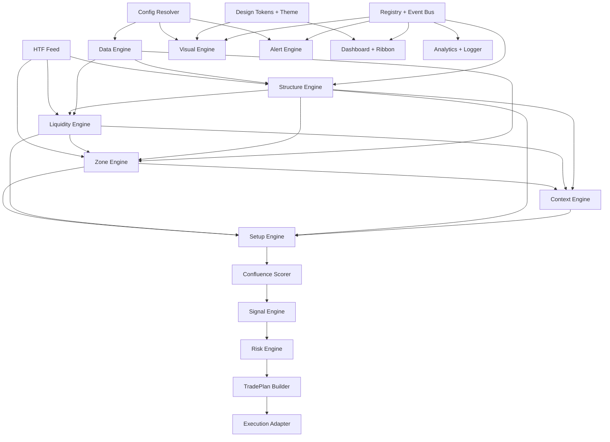
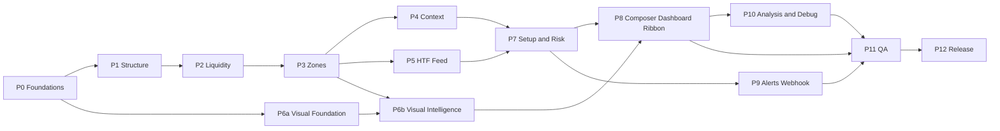
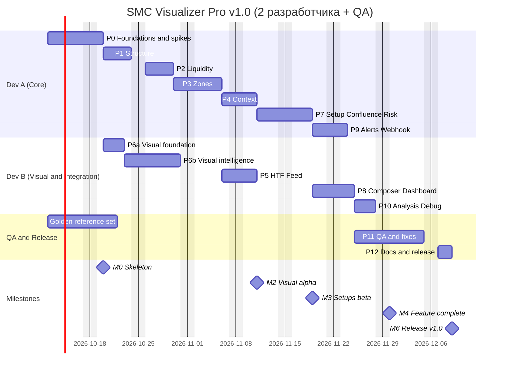

# 06 · Roadmap · Пошаговый план · Dependency Graph · Critical Path

> Покрывает результаты анализа **№21–23** и пошаговый план разработки v1.0.
> Оценки — в человеко-днях (ч/д) для разработчика уровня Senior Pine Script. QA — отдельная роль (частичная занятость).

---

## 21. Roadmap v1.0 → v2.0 → v3.0

### 21.1 Обзор версий

```
v1.0  Visual Intelligence ──► v1.1 Coverage ──► v1.5 Measurement ──► v2.0 Automation-ready ──► v2.x Flow ──► v3.0 Intelligence
 ядро + визуал + сетапы       S&D, VI/LV/BPR,     Outcome Tracker,     Strategy, TradePlan,       CVD, VP,       AI-ассистент,
 (аналитические), алерты,     RB, IFVG+, SB,      статистика,          Risk/sizing, шлюз,         SMT+           разметка по фото,
 webhook v1                   Judas, Mono+        калибровка грейдов   Telegram, журнал                          community, screener
```

### 21.2 v1.0 — Visual Intelligence

| | |
|---|---|
| **Цель** | Трейдер за секунды понимает состояние рынка и видит причинно-следственную цепочку. Ядро готово к автоматизации |
| **Scope** | Слои L0–L4 (L4 — только отображение риска), Event Bus, Registry, HTF Feed (HTF1 + опц. HTF2), Structure (internal/swing, MSS, strong/weak), Liquidity (swing, EQ, Key Levels, sweep/taken), Zones (OB, FVG, Breaker, Mitigation Block, IFVG), Context (range, PD, OTE, сессии NY time, bias, regime), Setup (SWEEP_REVERSAL, CONTINUATION), Confluence, Signal, Risk (display), Visual Engine полностью, режимы Clean/Normal/Analysis/Debug, Dashboard, Ribbon, Range Gauge, Alerts (alertcondition + батч JSON), документация |
| **Не входит** | Исполнение, sizing, S&D/VI/LV/BPR/RB (архитектурно предусмотрены), трендлинии, Mono+, Outcome Tracker |
| **Exit criteria** | Все AC (§27) и VAC (§28) пройдены. Golden-журналы совпадают. Repaint-аудит 100%. Профилирование в бюджете |

### 21.3 v1.1 — Coverage

| | |
|---|---|
| **Цель** | Полный охват примитивов ТЗ v1 без ущерба для читаемости |
| **Scope** | S&D (DBR/RBD/RBR/DBD) с собственной формой; VI, LV, BPR; Rejection Block; трендлинии ликвидности (только Analysis); модели BREAKER_RETEST, SILVER_BULLET, JUDAS_REVERSAL; TP по Standard Deviation; палитра Mono+; локализация RU/ES текстов графика |
| **Exit criteria** | Новые kind проходят VAC-6 (различимость) и VAC-1 (Normal не перегружен при включении всех) |

### 21.4 v1.5 — Measurement

| | |
|---|---|
| **Цель** | Измеримость качества сетапов, калибровка скоринга |
| **Scope** | Setup Outcome Tracker (§20.4); статистика по моделям, грейдам, сессиям и HTF-согласованности в Analysis-дашборде; экспорт журнала через `log.info` CSV и webhook; пересмотр весов скоринга по данным (без переподгонки — пресеты) |
| **Exit criteria** | ≥ 300 завершённых сетапов на 6+ инструментах. Монотонность «грейд → expectancy» подтверждена (или веса пересмотрены) |

### 21.5 v2.0 — Automation-ready

| | |
|---|---|
| **Цель** | Исполнимые планы, бэктест той же логики, безопасная автоматизация |
| **Scope** | Strategy-сборка (то же ядро); TradePlan полностью (ревизии, PLAN_NEW/AMEND/CANCEL); Risk Engine с sizing (`request.currency_rate`); webhook-интенты; эталонная спецификация Execution Gateway и reference-реализация (вне Pine); Telegram (уведомления, semi-auto подтверждения, kill switch); trade journal + CSV (в шлюзе); модели PO3/AMD; SMT Divergence (второй символ через `request.security`); IPDA-уровни (20/40/60 дней); Fibonacci OTE — авто (уже в v1.0 как OTE-полоса), расширения −0.27/−0.62 |
| **Exit criteria** | Strategy Tester и Outcome Tracker совпадают ≥ 99% по исходам. Shadow-режим 4 недели без инцидентов. Risk Guard протестирован сценариями отказов |

### 21.6 v2.x — Flow

Order Flow: CVD и delta через `request.security_lower_tf` (с учётом ограничений глубины lower-TF данных), Volume Profile сессий (POC/VAH/VAL), «институциональные свечи» (displacement + объём + FVG). Новые факторы скоринга — только после проверки в v1.5-аналитике.

### 21.7 v3.0 — Intelligence

| Направление | Архитектурная опора |
|---|---|
| AI-ассистент анализа | Внешний сервис, потребляющий поток событий и снимков (webhook) — «объясни текущий контекст». Pine не меняется |
| Разметка по фото графика | Внешний сервис. Выход — в формате Event/Zone-моделей (§6, §8) для сравнения с индикатором |
| Community-база сетапов | Хранилище TradePlan/Setup JSON (§12) с исходами из журнала шлюза |
| TradingView Screener | Служебные plot'ы (setup state, grade, bias, PD) с `display.data_window` — совместимость с Pine Screener |

### 21.8 Перенос пунктов roadmap ТЗ v1

| Пункт ТЗ v1 §10 | Новая версия |
|---|---|
| Strategy-версия с бэктестом | v2.0 |
| Risk-management, position sizing | v2.0 (модели определены в v1.0) |
| Trade journal + CSV | v2.0 (шлюз) |
| Telegram-бот | v2.0 |
| Институциональные свечи | v2.x |
| SMT Divergence | v2.0 |
| Power of 3 (AMD) | v2.0 |
| IPDA уровни | v2.0 |
| Fibonacci OTE авто | **v1.0** (OTE-полоса диапазона) + v1.1 (STDEV-цели) |
| Order Flow (CVD, Delta) | v2.x |
| Volume Profile | v2.x |
| AI, фото-разметка, community, screener | v3.0 |

---

## 21.9 Пошаговый план разработки v1.0

Каждая фаза заканчивается **демо-сборкой** и проверкой Definition of Done (DoD). Видео-демонстрация не делается (решение заказчика): демо — это сборка + скриншоты + журнал событий.

### P0 · Foundations & Spikes — 6 ч/д

| Задача | Результат |
|---|---|
| Репозиторий, структура `/src`, build-скрипт (конкатенация, версия, проверка размера), CHANGELOG | Сборка `dist/*.pine` одной командой |
| Технические спайки S-1…S-9 (§24.2) | Протокол спайков с решениями, обновлённые ADR |
| `02_types`: enums и UDT (§8) | Типы компилируются |
| `01_config`: inputs (§14.4), профили, пресеты, валидация, авто-HTF | Effective config в Debug-таблице |
| `03_registry_bus`: Registry, Event Bus, ключи | Тестовые события в `log.info` |
| `10_data_engine`: ATR, геометрия, displacement, объём, сессионные часы, тип графика, warm-up | `BarCtx` в Debug |
| Golden reference set: выбрать отрезки (6 инструментов × 3 ТФ), ручная эталонная разметка (QA) | `tests/annotations/` |

**DoD:** скрипт компилируется; профили применяются; шина пишет события в лог; спайки закрыты с решениями.

### P1 · Structure Engine — 4 ч/д

Пивоты internal/swing (A.2), HH/HL/LH/LL и EQ-флаг (A.3), автомат структуры (§7.1), BOS/CHoCH/MSS, initial BOS, close/wick (A.4), strong/weak и protected levels (A.5), события SWING/BOS/CHOCH.
**DoD:** журнал BOS/CHoCH совпадает с эталонной разметкой ≥ 95% на golden-отрезках, расхождения объяснены. Repaint: 0 изменений в Bar Replay.

### P2 · Liquidity Engine — 4 ч/д

Уровни из свингов, EQ-кластеры (A.12), Key Levels (PDH/PDL, PWH/PWL, AH/AL, LOH/LOL, NYH/NYL, MOP), автомат уровня (§7.2): SWEPT (wick/reclaim), TAKEN, PENDING_RECLAIM, Turtle Soup-классификация, importance/major (A.13).
**DoD:** свипы и пробои на golden-отрезках совпадают с эталоном ≥ 95%. Нет свипов на барах закрытия за уровнем без возврата.

### P3 · Zone Engine — 5 ч/д

OB (A.7: окно ноги, режимы зоны, фильтры, displacement, объём с авто-деградацией), lifecycle (§7.3), конверсия BB/MB (A.8), FVG (A.10: размер, session gaps, fill rules), lifecycle (§7.4), IFVG, вытеснение, аннотация HTF-контейнера.
**DoD:** OB = «последняя противоположная свеча ноги» на 100% эталонных случаев. FVG только при реальном разрыве. Переходы автоматов валидны (ассерты).

### P4 · Context Engine — 3 ч/д

Dealing range (A.14, §7.5), PD % и OTE, сессии и killzones в NY time с DST (A.15), session H/L → Key Levels, HTF bias (A.16), режим (A.17), `MarketContext`.
**DoD:** killzones корректны в зимнее и летнее время и в «окна несовпадения DST» США/Европы. PD/OTE согласованы с диапазоном.

### P5 · HTF Feed — 3 ч/д

Кортеж подтверждённого HTF-бара (S-1), буфер, прогон движков с TF slot = HTF, HTF-события, контроль глубины, fallback (S-2), авто-HTF, HTF2 для bias.
**DoD:** HTF-события в истории и в Bar Replay идентичны. ⚠ при недостатке истории.

### P6a · Visual Foundation — 3 ч/д

Токены (§13), Theme Resolver, палитры Standard/CVD, пулы по z-слоям, ViewHandle, dirty-check, базовые рендереры (линии структуры, уровни, боксы зон) без приоритизации.
**DoD:** объекты P1–P3 рисуются по токенам на тёмной и светлой теме. Full render на `islastconfirmedhistory`, инкремент на realtime.

### P6b · Visual Intelligence — 6 ч/д

Relevance Score (§16), конвейер Anti-Clutter (§15.2): слияние, кластеризация, HTF-доминирование, Nearest-N, окно дистанции, TTL, гистерезис; бюджеты; Smart Labels (§14.7); режимы Clean/Normal/Analysis/Debug (матрица §19.2); тексты L0–L3; тултипы.
**DoD:** VAC dry-run (5-секундный тест на 3 участниках) в Clean/Normal. Нет наложения меток на golden-отрезках. Лимиты бюджета соблюдены.

### P7 · Setup / Confluence / Signal / Risk — 6 ч/д

Автомат сетапа (§7.7), модели SWEEP_REVERSAL и CONTINUATION (A.18), выбор POI (§9.4), Confluence + пресеты (§9.5–9.6), Signal Engine (фильтры, кулдаун, дедупликация), Risk Engine (SL/TP/RR, проверки §11.3), TradePlan (DRAFT), Execution Adapter (no-op).
**DoD:** на golden-отрезках каждый сетап проходит ручную верификацию цепочки. Нет сетапов в warm-up. Инвалидация и экспирация срабатывают по правилам.

### P8 · Setup Composer · Dashboard · Ribbon · Gauge — 4 ч/д

Композиция сетапа (§14.8) со всеми состояниями, карточка, ценовые маркеры (опц.), Dashboard (§14.5) Compact/Expanded, Ribbon (§14.6), Range Gauge (§14.13), локализация текстов (EN; RU/ES-словари — v1.1).
**DoD:** 13 вопросов (§14.1) отвечаются в целевое время (VAC-2, -9, -10, -11).

### P9 · Alerts & Webhook — 3 ч/д

`alertcondition()` (15 условий), батч-`alert()` на бар, форматы Text/JSON, сериализация (§12), SNAPSHOT, фильтры, `cfg_hash`, инструкция по созданию и пересозданию алертов.
**DoD:** JSON валиден (JSON-schema-проверка на стороне тест-приёмника), нет дублей `msg_id`, алерты только на закрытии бара, нет троттлинга на M1 при всех событиях.

### P10 · Analysis & Debug tooling — 3 ч/д

Setup Path, Event Timeline, Focus/Inspect (`input.time` с `confirm`), прошлые сетапы, «почему нет сетапа», ghost-объекты, Budget table, `log.*`-поток, ассерты.
**DoD:** для любого сетапа golden-отрезка Path воспроизводит цепочку (VAC-15). Debug не меняет журнал событий (сравнение журналов Normal vs Debug — идентичны).

### P11 · QA, производительность, исправления — 8 ч/д

Функциональные AC (§27), golden-регрессия, repaint-аудит (Bar Replay + realtime-запись), VAC-протоколы (§28), матрица инструментов и ТФ (§27.4), Pine Profiler и оптимизация, исправления.
**DoD:** все AC/VAC «pass», QA-отчёт.

### P12 · Документация и релиз — 2 ч/д

README (RU/EN): модули, режимы, словарь, политика repaint, инструкции по алертам; тултипы; пресеты; CHANGELOG; скриншоты по режимам и инструментам; release-сборка и публикация (invite-only).
**DoD:** формат сдачи (§21.11) собран.

### 21.10 Сводка оценок

| Фаза | ч/д | Исполнитель |
|---|---:|---|
| P0 Foundations & Spikes | 6 | A + B |
| P1 Structure | 4 | A |
| P2 Liquidity | 4 | A |
| P3 Zones | 5 | A |
| P4 Context | 3 | A |
| P5 HTF Feed | 3 | B |
| P6a Visual Foundation | 3 | B |
| P6b Visual Intelligence | 6 | B |
| P7 Setup / Confluence / Signal / Risk | 6 | A |
| P8 Composer / Dashboard / Ribbon | 4 | B |
| P9 Alerts & Webhook | 3 | A |
| P10 Analysis & Debug | 3 | B |
| P11 QA + fixes | 8 | A + B + QA |
| P12 Docs & release | 2 | A + B |
| **Итого** | **≈ 60 ч/д** | **1 разработчик ≈ 12 недель. 2 разработчика ≈ 42 рабочих дня (≈ 8.5 недель) по критическому пути** |

**MVP-срез (≈ 42–45 ч/д):** только Clean/Normal (Analysis — без Path и Inspect), одна модель сетапа (SWEEP_REVERSAL), без IFVG и Range Gauge, HTF1 без HTF2, Dashboard только Compact. Остальное — в v1.0.1–v1.0.3.

> Сравнение с ТЗ v1 (21 день): разница объясняется не «раздуванием», а тем, что в ТЗ v1 не было архитектуры, дизайн-системы, сетапов, визуального QA, спайков и golden-регрессии. Без них 21 день привёл бы к перегруженному графику и переписыванию в v2.

### 21.11 Формат сдачи v1.0

| Артефакт | Содержание |
|---|---|
| `dist/SMC_Visualizer_Pro_v1.0.pine` | Собранный монолит |
| `src/` + build | Модульные исходники (для заказчика и сопровождения) |
| README (RU/EN) | Модули, режимы, словарь сокращений, Repaint Policy, алерты и webhook, FAQ |
| CHANGELOG | Версии, изменения, совместимость схемы webhook |
| Скриншоты | 6+ инструментов × режимы Clean / Normal / Analysis × темы Dark / Light (+ CVD) |
| Golden-журналы | `tests/golden/*.csv` — эталонные журналы событий |
| QA-отчёт | AC и VAC с результатами, профилирование, repaint-аудит |
| Пресеты и алерты | Описание рекомендуемых настроек и созданных демонстрационных алертов |
| ~~Видео-демонстрация~~ | **Исключено по решению заказчика** |

---

## 22. Dependency Graph

### 22.1 Компоненты



> Visual, Alert, Dashboard и Analytics читают Registry и Event Bus и **не имеют исходящих рёбер** в логические компоненты (T-1, T-9). Граф ацикличен.

### 22.2 Таблица зависимостей

| Компонент | Зависит от | Требуется для | Фаза |
|---|---|---|---|
| Config Resolver | inputs | всех | P0 |
| Registry + Event Bus | Types | всех движков и sinks | P0 |
| Data Engine | Config | всех движков | P0 |
| Structure Engine | Data, Registry | Liquidity, Zone, Context, Setup | P1 |
| Liquidity Engine | Structure, Data | Zone (флаг снятия), Context, Setup, Risk (цели) | P2 |
| Zone Engine | Structure, Liquidity, Data | Context, Setup | P3 |
| Context Engine | Structure, Liquidity, Zone, HTF | Setup, Confluence, Dashboard | P4 |
| HTF Feed | Structure, Liquidity, Zone (код), Data | Context (bias), Confluence (HTF POI), Visual (HTF) | P5 |
| Setup Engine | Context, Structure, Liquidity, Zone | Confluence | P7 |
| Confluence | Setup, Context, HTF | Signal, Visual (грейд) | P7 |
| Signal Engine | Confluence | Risk, Alerts | P7 |
| Risk + TradePlan | Signal, Liquidity | Execution Adapter, Composer | P7 |
| Design Tokens + Theme | Config | Visual, Dashboard | P6a |
| Visual Foundation | Tokens, Registry | Visual Intelligence, Composer | P6a |
| Visual Intelligence | Visual Foundation, движки L2 | Composer, режимы | P6b |
| Setup Composer, Dashboard, Ribbon | Visual Intelligence, Setup, Context | VAC | P8 |
| Alert Engine + Webhook | Event Bus, Setup, Plan | AC алертов | P9 |
| Analysis / Debug tooling | Visual, Setup.chain, Event history | VAC-15, QA | P10 |

### 22.3 Фазы



---

## 23. Critical Path

### 23.1 Критический путь (2 разработчика + QA)

```
P0 (6) → P1 (4) → P2 (4) → P3 (5) → P4 (3) → P7 (6) → P8 (4) → P11 (8) → P12 (2)   = 42 рабочих дня
```

| Некритичные задачи | Резерв (float) | Условие |
|---|---|---|
| Цепочка P6a → P6b | ≈ 9 дней | По графику P6b заканчивается на 15-й день, но зональную часть можно закрыть только после P3 (19-й день). P8 стартует на 29-й день |
| P5 HTF Feed | 0 дней | Стартует после P3 параллельно с P4 и должен быть готов к P7 (HTF в скоринге). **Критичен наравне с P4** |
| P9 Alerts | ≈ 1 день | Параллельно с P8 |
| P10 Analysis/Debug | ≈ 5 дней | Параллельно с началом P11 (QA начинает с ядра). Должен завершиться за ~3 дня до конца P11, чтобы успеть QA Analysis/Debug |
| Golden reference set (QA) | ≈ 2 дня | Нужен к DoD P1 (10-й день) |

### 23.2 Диаграмма Ганта (условный старт — понедельник 2026-10-12)



### 23.3 Вехи

| Веха | Когда | Содержание | Проверка |
|---|---|---|---|
| **M0 Skeleton** | конец P0 | Компилируется, профили, шина, бюджет, Debug-таблица, решения спайков | Ревью ADR |
| **M1 Structure & Liquidity** | конец P2 (+P6a) | BOS/CHoCH, уровни, свипы на графике по токенам | Golden ≥ 95% |
| **M2 Visual alpha** | конец P4 (+P6b) | Зоны, диапазон, сессии, приоритет, anti-clutter, режимы | VAC dry-run (5-секундный тест) |
| **M3 Setups beta** | конец P7 (+P5) | HTF, сетапы, скоринг | Ручная верификация цепочек |
| **M4 Feature complete** | конец P10 | Композиция, Dashboard, Ribbon, алерты, Analysis/Debug | Полный прогон AC |
| **M5 Release Candidate** | конец P11 | Все AC/VAC pass | QA-отчёт |
| **M6 v1.0** | конец P12 | Публикация | Формат сдачи |

### 23.4 Управление критическим путём

1. **Спайки в P0** снимают главные технические неопределённости до старта движков (S-1 HTF, S-3 рендер, S-7 лимиты компиляции).
2. **P5 почти критичен** → если S-1/S-2 выявили сложности, HTF-скоринг временно отключается флагом (`htfReliable = false`), P7 не блокируется.
3. **P6b стартует до готовности зон** (структура и ликвидность уже есть) → не задерживает P8.
4. **Буфер риска:** +15% к критическому пути (≈ 6 дней) — закладывается в коммерческий срок: **≈ 48 рабочих дней** для 2 разработчиков.
5. **Правило «логика замораживается к M3»:** после M3 изменения детекторов — только исправления дефектов, иначе golden-журналы и VAC-тесты придётся переделывать.
